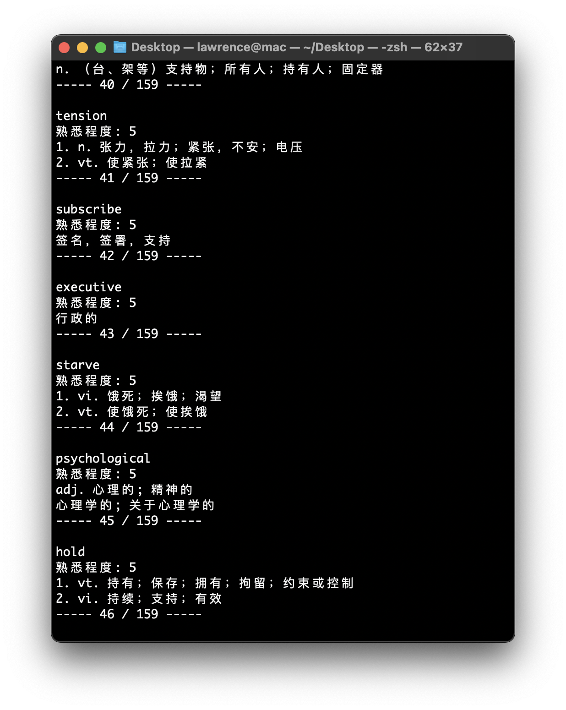

# Recite words by Command-Line Interface

## Get your eudic account

Register an account:

https://dict.eudic.net/Account/Register

## Expose the account to your shell

On macOS / Linux:

```shell
export EUDIC_USERNAME="name@example.com"
export EUDIC_PASSWORD="password"
```

On Windows:
You had better to use the WSL. If you're using the CMD, maybe the `set` command helps.

## Use the released binary artifact

Download the released artifact or you can do the build by your self:

```shell
go build
```

If the executable binary artifact shows up, you can run it.

```shell
chmod +x word
./word
```



## Reference

Check out the SDK: https://github.com/Lonor/go-eudic